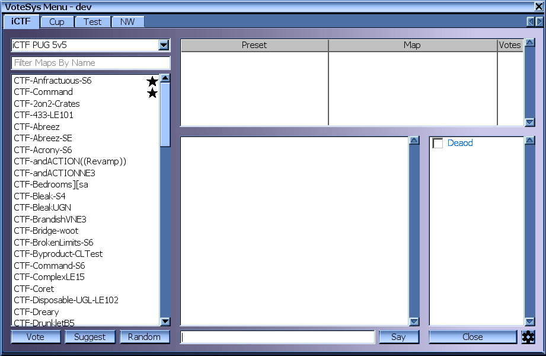
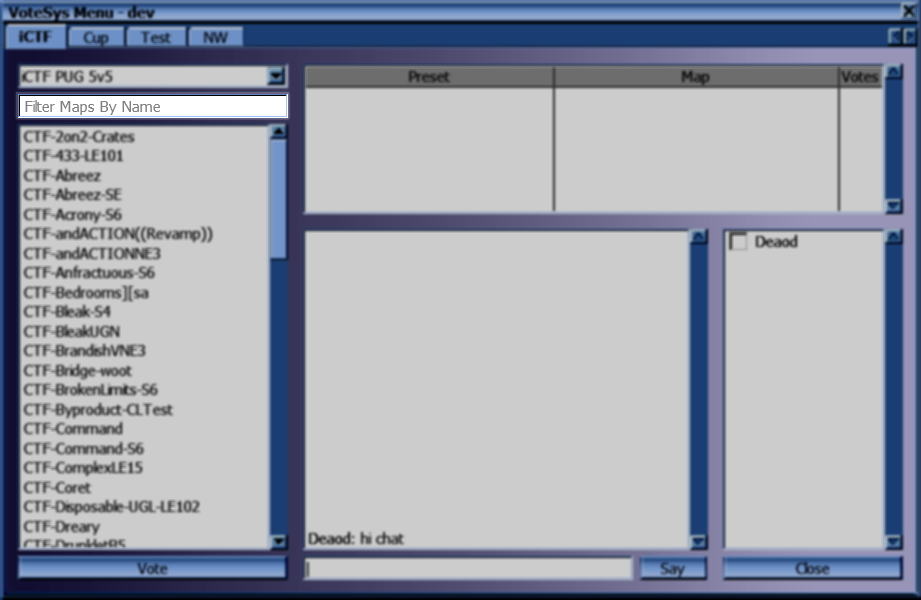
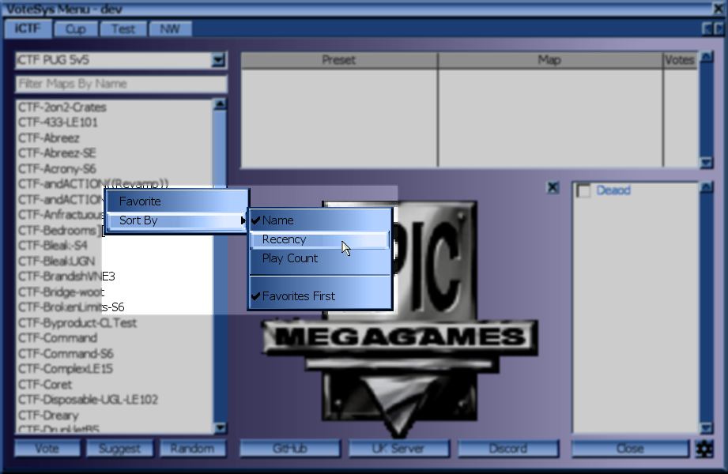
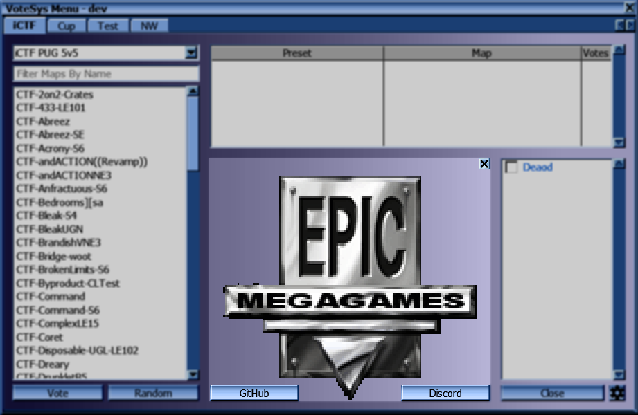
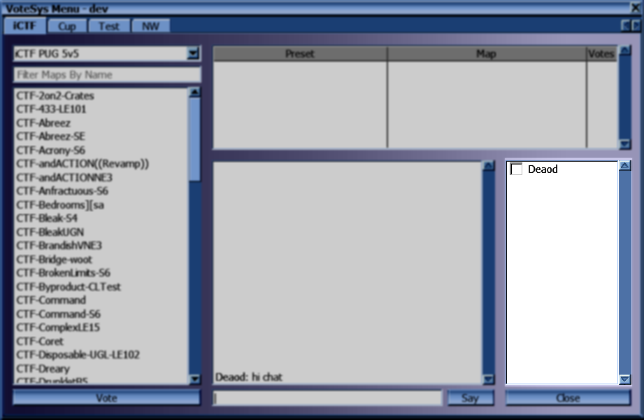
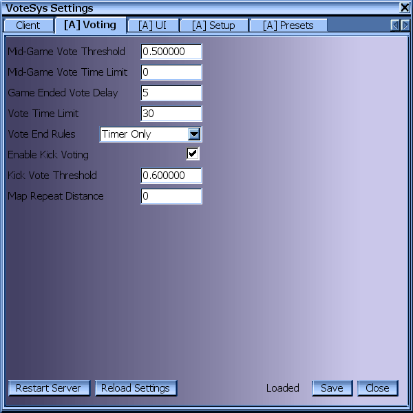
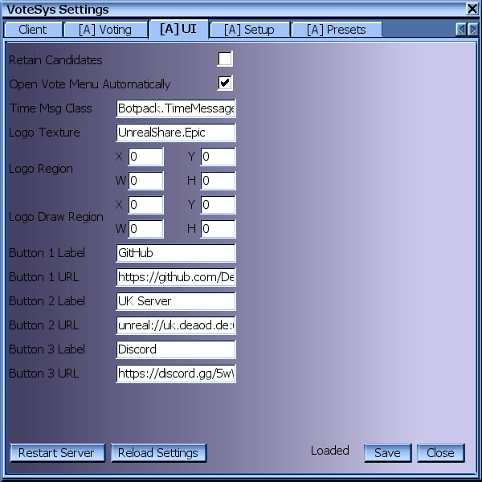
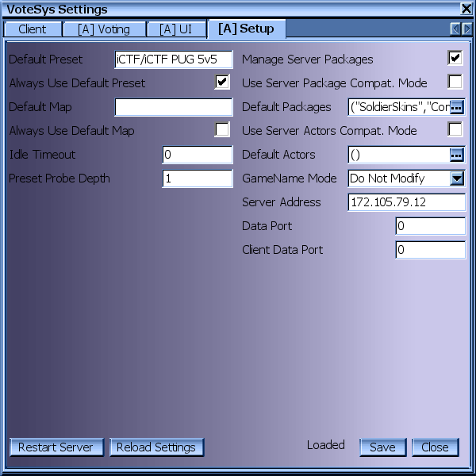
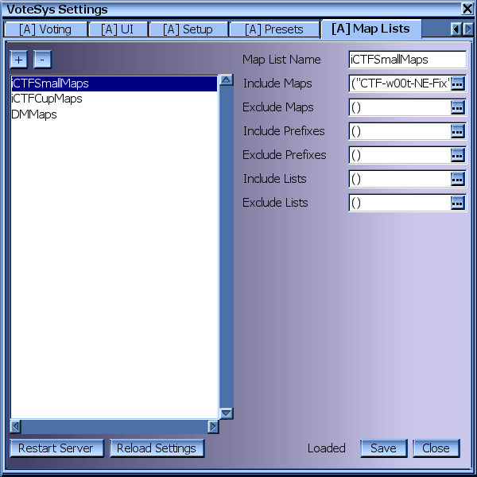

# VoteSys User Interface

## Vote Menu

### Dark Mode

### Category Tabs

Each category has its own tab here. If the category of a preset is empty, it will appear in a tab called "Default".

### Preset Dropdown

Selects which map list to show. When first opening the voting menu, the category and preset that are currently in use are selected. Grayed out presets have player limitations that prevent the preset from being voted for.

### Map List Filter

Allows filtering the map list. Only maps containing the sequence of letters entered here will be shown.

### Map List

Shows the maps available to be used with the currently selected preset.  
Maps unavailable due to player limits or repetition restrictions are grayed out and cannot be selected.

Selecting a map clears any current selection in the candidate list.  
Double-clicking votes for the map and preset combination.  
Alternatively, you can vote for a map/preset combination by selecting a map in the list and pressing the "Vote" button.

The "Suggest" button will select a suitable map from the list and place your vote for it.

The "Random" button will place your vote for a random map of the currently selected preset.

#### Map Favorites

Maps with a filled in star next to their name have been marked as a favorite.

The outline of a star is shown when hovering over maps in the list.

Maps can also be marked as favorites through the [context menu](#map-context-menu).

By default, your favorite maps are show at the top of the list.

#### Map Screenshot Preview

After hovering over a map in the map list for half a second, a window showing the screenshot of the map will appear.

This window will also show player limits, if specified.

#### Map Context Menu

Right clicking a map will bring up a context menu where you can change how maps are sorted.

### Candidate List

Shows all preset and map combinations with at least one vote. Candidates are sorted by the amount of votes for them.

Selecting a candidate clears any current selection in the map list.  
Double-clicking a candidate adds your vote to it.  
Alternatively, you can vote for a candidate by selecting one and pressing the "Vote" button.

### Chat Area

Shows chat messages sent by other players. Does not show messages sent only to your own team.

You can write a message in the field at the bottom and either press the "Say" button or press the "Enter" key.

If you hold the "Ctrl" key while sending a message, it will be sent to your own team exclusively (and not show up in the chat area).

You can recall past messages sent by you by pressing the Up arrow key repeatedly.

### Logo Area

If the server admin has configured a logo, that logo will be shown instead of the chat area. The logo can be dismissed by pressing the X button in the top right. Dismissing the logo will restore the chat area.

Additionally, server admins can configure up to 3 buttons that will be shown along the bottom edge of the logo area.

### Player List

Shows a list of players and whether they have voted already.

Right clicking on a player opens a context menu.

This menu contains the ID of the player, and a way to kick or ban the player. Banning is only possible with admin rights and also requires confirming the ban.

Selecting Kick in the menu without admin privileges places a vote to kick that player. Opening the menu for the same player again will show a checkmark next to the Kick entry. Selecting Kick again will retract your vote to kick the player.

With admin privileges Kick will instantly kick the player and prevent players from the same IP from joining again for the duration of the current match.

### Close Button

The Close button does exactly what it says: It closes the vote menu.

### Settings Button

The Settings button with the gear icon opens a settings menu. See [Settings Menu](#settings-menu).

## Settings Menu

### Client Settings

Allows changing client-side settings.

The Save button saves the current state of settings. The Close button closes the Settings Menu without saving.

### Admin Settings

Admin settings are split into three parts: Voting, UI, and Setup. The tab-cards containing admin settings are prefixed with \[A\] and are only visible when logged in as admin.

#### Voting

#### UI

#### Setup

### Presets Settings

This tab-card is only visible when logged in as admin. It allows changing preset settings.

### Map Lists Settings

This tab-card is only visible when logged in as admin. It allows editing map lists, including adding and removing them.

