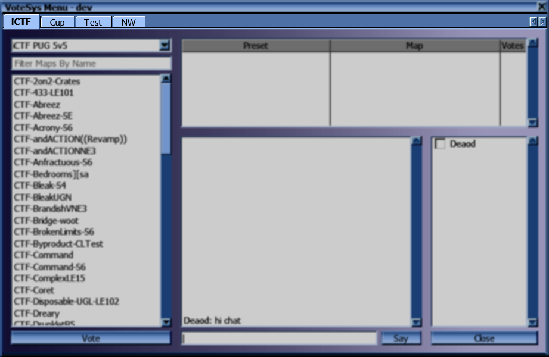
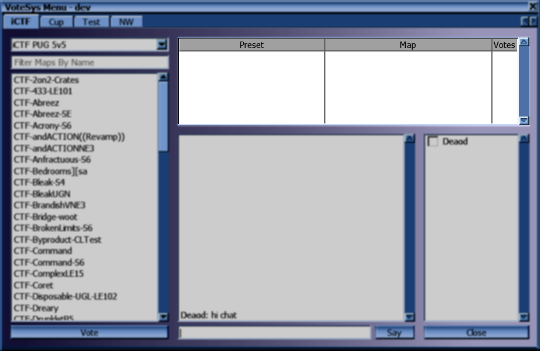

# VoteSys User Interface

## Category Tabs

Each category has its own tab here. If the category of a preset is empty, it will appear in a tab called "Default".

## Preset Dropdown

Selects which map list to show. When first opening the voting menu, the category and preset that are currently in use are selected.

## Map List

Shows the maps available to be used with the currently selected preset.

Selecting a map clears any current selection in the candidate list.  
Double-clicking votes for the map and preset combination.  
Alternatively, you can vote for a map/preset combination by selecting a map in the list and pressing the "Vote" button.

## Candidate List

Shows all preset and map combinations with at least one vote. Candidates are sorted by the amount of votes for them.

Selecting a candidate clears any current selection in the map list.  
Double-clicking a candidate adds your vote to it.  
Alternatively, you can vote for a candidate by selecting one and pressing the "Vote" button.

## Player List

Shows a list of players and whether they have voted already.

## Chat Area

Shows chat messages sent by other players. Does not show messages sent only to your own team.

You can write a message in the field at the bottom and either press the "Say" button or press the "Enter" key.

If you hold the "Ctrl" key while sending a message, it will be sent to your own team exclusively (and not show up in the chat area).

You can recall past messages sent by you by pressing the Up arrow key repeatedly.
