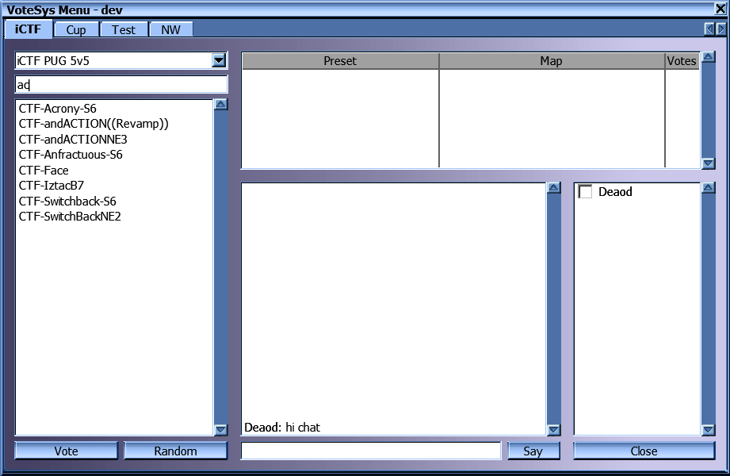
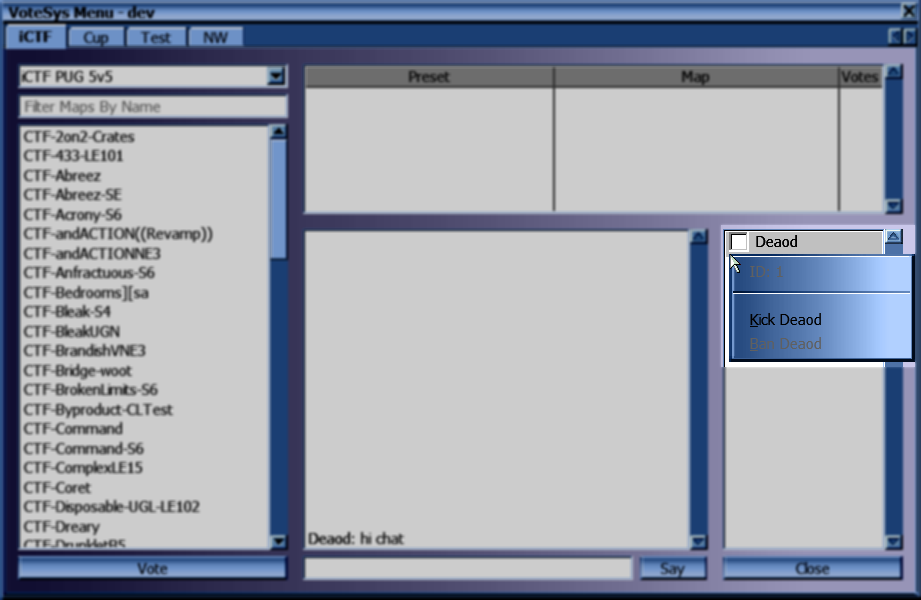

# VoteSys User Interface

## Category Tabs

Each category has its own tab here. If the category of a preset is empty, it will appear in a tab called "Default".

## Preset Dropdown

Selects which map list to show. When first opening the voting menu, the category and preset that are currently in use are selected.

## Map List Filter

Allows filtering the map list. Only maps containing the sequence of letters entered here will be shown.

## Map List

Shows the maps available to be used with the currently selected preset.

Selecting a map clears any current selection in the candidate list.  
Double-clicking votes for the map and preset combination.  
Alternatively, you can vote for a map/preset combination by selecting a map in the list and pressing the "Vote" button.

The "Random" button will place your vote for a map randomly selected from the list you're currently viewing.

### Map Screenshot Preview

After hovering over a map in the map list for half a second, a window showing the screenshot of the map will appear.

## Candidate List

Shows all preset and map combinations with at least one vote. Candidates are sorted by the amount of votes for them.

Selecting a candidate clears any current selection in the map list.  
Double-clicking a candidate adds your vote to it.  
Alternatively, you can vote for a candidate by selecting one and pressing the "Vote" button.

## Player List

Shows a list of players and whether they have voted already.

Right clicking on a player opens a context menu.

This menu contains the ID of the player, and a way to kick or ban the player. Banning is only possible with admin rights and also requires confirming the ban.

Selecting Kick in the menu without admin privileges places a vote to kick that player. Opening the menu for the same player again will show a checkmark next to the Kick entry. Selecting Kick again will retract your vote to kick the player.

With admin privileges Kick will instantly kick the player and prevent players from the same IP from joining again for the duration of the current match.

## Chat Area

Shows chat messages sent by other players. Does not show messages sent only to your own team.

You can write a message in the field at the bottom and either press the "Say" button or press the "Enter" key.

If you hold the "Ctrl" key while sending a message, it will be sent to your own team exclusively (and not show up in the chat area).

You can recall past messages sent by you by pressing the Up arrow key repeatedly.
